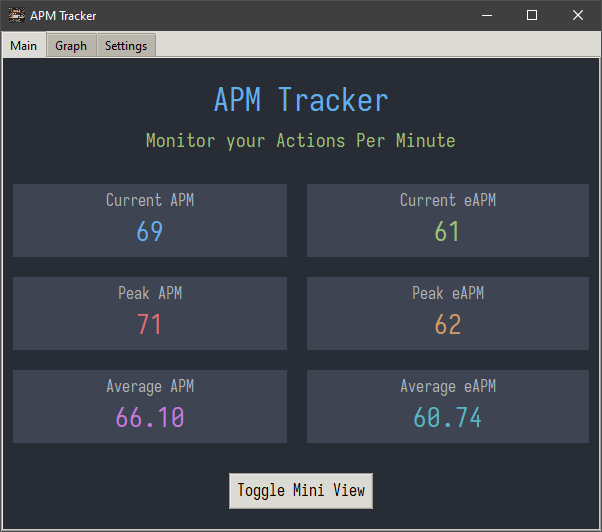
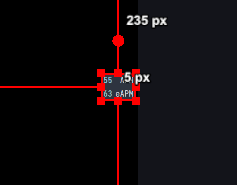
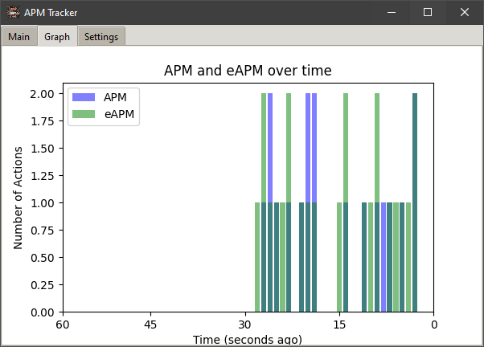
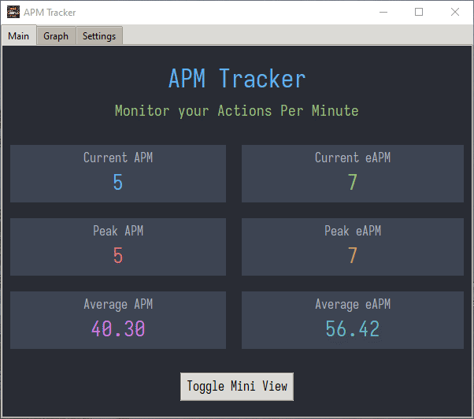

# APM Tracker

APM Tracker is a sophisticated Python application designed to measure and display Actions Per Minute (APM) and effective Actions Per Minute (eAPM) for computer users. It's particularly beneficial for gamers, especially those engaged in real-time strategy (RTS) games, where APM is a crucial metric of player performance and efficiency.

## Features

- Real-time tracking of APM and eAPM with customizable update intervals
- Dynamic graphical display of APM and eAPM over time with adjustable time ranges
- Peak APM and eAPM tracking for performance benchmarking
- Average APM and eAPM calculation for long-term performance analysis
- Mini-view mode for unobtrusive monitoring during gameplay or work
- Target program focus to track APM only for specific applications
- Adjustable transparency for seamless integration with other on-screen elements
- Customizable update intervals and graph settings for personalized tracking
- Comprehensive logging system with adjustable log levels for debugging and analysis
- Cross-platform compatibility (Windows and Linux)

## Installation

### Pre-built Executables

For ease of use, pre-built executables are available for both Windows and Linux platforms. You can download the latest version from the [Releases](https://github.com/yourusername/apm-tracker/releases) page.

### From Source

For developers or users who prefer to run from source:

1. Clone this repository or download the source code:
   ```sh
   git clone https://github.com/yourusername/apm-tracker.git
   ```

2. Navigate to the project directory:
   ```sh
   cd apm-tracker
   ```

3. Install the required packages:
   ```sh
   pip install -r requirements.txt
   ```

4. Run the application:
   ```sh
   python src/main.py
   ```

## Usage

### Running the Application

#### Windows
Simply double-click the `APMTracker.exe` file to launch the application.

#### Linux
To run the Linux binary:

1. Open a terminal in the directory containing the `APMTracker` binary.
2. Make the file executable (if necessary):
   ```sh
   chmod +x APMTracker
   ```
3. Run the application:
   ```sh
   ./APMTracker
   ```

### Application Interface

- **Main Window**: Displays real-time APM, eAPM, peak values, and averages.
- **Graph Tab**: Shows a dynamic histogram of APM and eAPM over time.
- **Settings Tab**: Allows customization of various parameters:
  - Window transparency
  - Target program selection
  - Update intervals
  - Graph settings
  - Log level
- **Mini View**: Toggle between full view and a compact mini view for unobtrusive monitoring.

## How It Works

### APM (Actions Per Minute)
APM is calculated by counting the total number of actions (keyboard presses and mouse clicks) performed by the user in one minute. The application tracks these actions in real-time and updates the APM count at customizable intervals.

### eAPM (effective Actions Per Minute)
eAPM is a more sophisticated metric designed to measure meaningful actions. It filters out repetitive or less significant inputs to provide a more accurate representation of impactful user actions.

### Graphs
The application generates real-time graphs of APM and eAPM. Users can customize the time range and update intervals to suit their preferences and analysis needs.

### Target Program Functionality
This feature enables users to focus APM tracking on a specific application, allowing for more precise performance measurement in particular programs or games.

## Project Structure

The project is organized into several modules for optimal maintainability and scalability:

```
apm-tracker/
│
├── src/
│   ├── gui/
│   │   ├── __init__.py
│   │   ├── gui_manager.py
│   │   ├── main_frame.py
│   │   ├── graph_frame.py
│   │   ├── settings_frame.py
│   │   └── mini_window.py
│   │
│   ├── utils/
│   │   ├── __init__.py
│   │   ├── input_manager.py
│   │   ├── data_manager.py
│   │   ├── settings_manager.py
│   │   ├── constants.py
│   │   ├── window_utils.py
│   │   ├── icon_utils.py
│   │   ├── font_loader.py
│   │   └── error_handler.py
│   │
│   ├── main.py
│   └── tracker.py
│
├── assets/
│   ├── icons/
│   │   ├── keebfire.ico
│   │   └── keebfire.png
│   ├── fonts/
│   │   └── IosevkaTermNerdFont-Regular.ttf
│   └── screenshots/
│       ├── apm_graph.png
│       ├── apm_main_window.png
│       ├── obs_mini_window.png
│       └── demo.gif
│
├── .github/
│   └── workflows/
│       └── deploy.yml
│
├── LICENSE
├── README.md
└── requirements.txt
```

### Detailed Module Descriptions

[The rest of the README.md content remains the same, with module descriptions accurately reflecting the current code structure.]

## Building the Application

[This section remains unchanged.]

## Screenshots

### Main Window


### Mini Window


### Graphs


## Demo


## Contributing

Contributions to enhance the APM Tracker are warmly welcomed. Whether you're fixing bugs, improving documentation, or proposing new features, your input is valuable. Please feel free to submit pull requests or open issues to suggest improvements or report bugs.

## License

This project is open source and available under the [MIT License](LICENSE). This license permits use, modification, and distribution of the software, subject to the conditions outlined in the license file.

## Disclaimer

APM Tracker is developed for educational and personal use only. Users should be aware of and respect the terms of service of any games or applications with which they use this software. The developers are not responsible for any misuse or violation of third-party terms of service.
