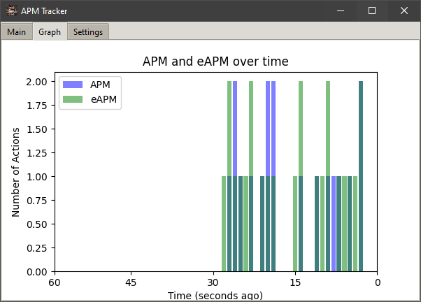

# APM Tracker

APM Tracker is a Python application that measures and displays Actions Per Minute (APM) and effective Actions Per Minute (eAPM) for computer users. It's particularly useful for gamers, especially in real-time strategy (RTS) games, where APM is a common metric of player performance.

## Features

- Real-time tracking of APM and eAPM
- Graphical display of APM and eAPM over time
- Peak APM and eAPM tracking
- Average APM and eAPM calculation
- Mini-view mode for unobtrusive monitoring
- Target program focus to track APM only for specific applications
- Adjustable transparency
- Hotkeys for quick access to features

## Requirements

- Python 3.12.5 or higher
- Required Python packages are listed in `requirements.txt`

## Installation

1. Clone this repository or download the source code.
2. Install the required packages:

   ```sh
   pip install -r requirements.txt
   ```

3. Run the script:

   ```sh
   python apm.py
   ```

## Building the Application

To create a standalone executable:

1. Ensure you have PyInstaller installed:
   ```sh
   pip install pyinstaller
   ```

2. Run PyInstaller:
   ```sh
   pyinstaller --name=APMTracker --windowed --add-data "icons:icons" --icon=icons/keebfire.ico main.py
   ```

3. The executable will be created in the `dist` directory.

## Usage

- The main window displays current APM, eAPM, peak values, and averages.
- The 'Graph' tab shows a histogram of APM and eAPM over time.
- In the 'Settings' tab, you can:
  - Adjust the transparency of the window
  - Set a target program to focus APM tracking
- Use the "Toggle Mini View" button to switch between full view and mini view.
- Press Ctrl+Shift+Q to quit the application.

## Screenshots

### Main Window


### Mini Window


### Graphs


## Contributing

Contributions to improve the APM Tracker are welcome. Please feel free to submit pull requests or open issues to suggest improvements or report bugs.

## License

This project is open source and available under the [MIT License](LICENSE).

## Disclaimer

This software is for educational and personal use only. Please be aware of and respect the terms of service of any games or applications you use this with.
