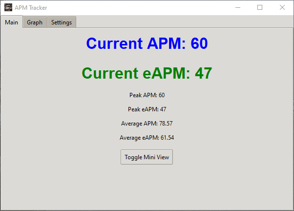

# APM Tracker

APM Tracker is a sophisticated Python application designed to measure and display Actions Per Minute (APM) and effective Actions Per Minute (eAPM) for computer users. It's particularly beneficial for gamers, especially those engaged in real-time strategy (RTS) games, where APM is a crucial metric of player performance and efficiency.

## Features

- Real-time tracking of APM and eAPM with customizable update intervals
- Dynamic graphical display of APM and eAPM over time with adjustable time ranges
- Peak APM and eAPM tracking for performance benchmarking
- Average APM and eAPM calculation for long-term performance analysis
- Mini-view mode for unobtrusive monitoring during gameplay or work
- Target program focus to track APM only for specific applications
- Adjustable transparency for seamless integration with other on-screen elements
- Customizable update intervals and graph settings for personalized tracking
- Comprehensive logging system with adjustable log levels for debugging and analysis
- Cross-platform compatibility (Windows and Linux)

## Installation

### Pre-built Executables

For ease of use, pre-built executables are available for both Windows and Linux platforms. You can download the latest version from the [Releases](https://github.com/yourusername/apm-tracker/releases) page.

### From Source

For developers or users who prefer to run from source:

1. Clone this repository or download the source code:
   ```sh
   git clone https://github.com/yourusername/apm-tracker.git
   ```

2. Navigate to the project directory:
   ```sh
   cd apm-tracker
   ```

3. Install the required packages:
   ```sh
   pip install -r requirements.txt
   ```

4. Run the application:
   ```sh
   python src/main.py
   ```

## Usage

### Running the Application

#### Windows
Simply double-click the `APMTracker.exe` file to launch the application.

#### Linux
To run the Linux binary:

1. Open a terminal in the directory containing the `APMTracker` binary.
2. Make the file executable (if necessary):
   ```sh
   chmod +x APMTracker
   ```
3. Run the application:
   ```sh
   ./APMTracker
   ```

### Application Interface

- **Main Window**: Displays real-time APM, eAPM, peak values, and averages.
- **Graph Tab**: Shows a dynamic histogram of APM and eAPM over time.
- **Settings Tab**: Allows customization of various parameters:
  - Window transparency
  - Target program selection
  - Update intervals
  - Graph settings
  - Log level
- **Mini View**: Toggle between full view and a compact mini view for unobtrusive monitoring.

## How It Works

### APM (Actions Per Minute)
APM is calculated by counting the total number of actions (keyboard presses and mouse clicks) performed by the user in one minute. The application tracks these actions in real-time and updates the APM count at customizable intervals.

### eAPM (effective Actions Per Minute)
eAPM is a more sophisticated metric designed to measure meaningful actions. It filters out repetitive or less significant inputs to provide a more accurate representation of impactful user actions.

### Graphs
The application generates real-time graphs of APM and eAPM. Users can customize the time range and update intervals to suit their preferences and analysis needs.

### Target Program Functionality
This feature enables users to focus APM tracking on a specific application, allowing for more precise performance measurement in particular programs or games.

## Project Structure

The project is meticulously organized into several modules for optimal maintainability and scalability:

```
apm-tracker/
│
├── src/
│   ├── gui/
│   │   ├── __init__.py
│   │   ├── gui_manager.py
│   │   ├── main_frame.py
│   │   ├── graph_frame.py
│   │   ├── settings_frame.py
│   │   └── mini_window.py
│   │
│   ├── utils/
│   │   ├── __init__.py
│   │   ├── input_manager.py
│   │   ├── data_manager.py
│   │   ├── settings_manager.py
│   │   ├── constants.py
│   │   ├── window_utils.py
│   │   └── icon_utils.py
│   │
│   ├── main.py
│   └── tracker.py
│
├── icons/
│   ├── keebfire.ico
│   ├── keebfire.jpg
│   └── keebfire.png
│
├── screenshots/
│   ├── apm_graph.png
│   ├── apm_main_window.png
│   └── obs_mini_window.png
│
├── .github/
│   └── workflows/
│       └── deploy.yml
│
├── LICENSE
├── README.md
└── requirements.txt
```

### Detailed Module Descriptions

#### src/

The `src` directory contains the core application code.

##### main.py
- **Purpose**: Serves as the entry point of the application.
- **Functionality**:
  - Initializes the APMTracker
  - Sets up logging based on user settings
  - Handles the main execution loop and exception management

##### tracker.py
- **Purpose**: Contains the main `APMTracker` class.
- **Functionality**:
  - Coordinates between other modules
  - Manages the overall application state
  - Initializes and manages key components like DataManager, SettingsManager, GUIManager, and InputManager

#### src/gui/

The `gui` directory contains all GUI-related modules.

##### gui_manager.py
- **Purpose**: Manages the graphical user interface.
- **Functionality**:
  - Creates and updates the main window, graph, and mini-view
  - Handles GUI events and user interactions
  - Manages the transition between full view and mini view

##### main_frame.py
- **Purpose**: Defines the main frame of the application.
- **Functionality**:
  - Displays current APM, eAPM, peak values, and averages
  - Updates values in real-time

##### graph_frame.py
- **Purpose**: Manages the graphical representation of APM and eAPM data.
- **Functionality**:
  - Creates and updates the APM/eAPM histogram
  - Handles graph customization (time range, update intervals)

##### settings_frame.py
- **Purpose**: Provides a user interface for application settings.
- **Functionality**:
  - Allows users to adjust transparency, target program, update intervals, and other settings
  - Handles saving and loading of user preferences

##### mini_window.py
- **Purpose**: Implements a compact view of the application.
- **Functionality**:
  - Displays essential information in a small, unobtrusive window
  - Allows for easy toggling between full and mini views

#### src/utils/

The `utils` directory contains utility modules and managers for various functionalities.

##### input_manager.py
- **Purpose**: Handles keyboard and mouse input detection.
- **Functionality**:
  - Uses the `pynput` library to detect user actions
  - Filters and processes input events
  - Sends processed actions to the tracker

##### data_manager.py
- **Purpose**: Manages data collection and calculations.
- **Functionality**:
  - Stores action data
  - Calculates APM and eAPM in real-time
  - Provides methods for data analysis and retrieval

##### settings_manager.py
- **Purpose**: Handles application settings and configurations.
- **Functionality**:
  - Manages saving and loading of user settings
  - Handles the target program functionality
  - Provides methods to update and retrieve various settings

##### constants.py
- **Purpose**: Defines constant values used throughout the application.
- **Functionality**:
  - Stores default values for settings
  - Defines color schemes and font settings
  - Provides other constant values used across modules

##### window_utils.py
- **Purpose**: Provides utility functions for window management.
- **Functionality**:
  - Handles window list updates for target program selection
  - Manages window styles and attributes

##### icon_utils.py
- **Purpose**: Manages application icons and related utilities.
- **Functionality**:
  - Provides functions to locate and set application icons
  - Ensures proper icon display across different platforms

#### icons/

This directory contains the application icons in various formats:
- `keebfire.ico`: Windows icon file
- `keebfire.jpg` and `keebfire.png`: Image files for cross-platform use

#### screenshots/

Contains screenshots of the application for documentation and promotional purposes:
- `apm_graph.png`: Screenshot of the APM/eAPM graph
- `apm_main_window.png`: Main application window screenshot
- `obs_mini_window.png`: Mini view screenshot

#### .github/workflows/deploy.yml

- **Purpose**: Defines the GitHub Actions workflow for automated builds and releases.
- **Functionality**:
  - Triggers on new tag pushes or manual activation
  - Builds Windows and Linux executables
  - Creates GitHub releases with the built executables

#### LICENSE

Contains the MIT License text, defining the terms under which the software is distributed and can be used.

#### README.md

Provides comprehensive documentation for the project, including installation instructions, usage guidelines, and project structure details.

#### requirements.txt

Lists all Python package dependencies required to run the application, ensuring easy setup for developers and contributors.

## Building the Application

The project utilizes GitHub Actions for automated builds, streamlining the process of creating executables for both Windows and Linux platforms.

### Automated Builds

The build process is defined in `.github/workflows/deploy.yml`. It is triggered automatically when:
- A new tag is pushed to the repository
- The workflow is manually triggered

The workflow performs the following steps:
1. Sets up the build environment (Windows and Linux)
2. Installs necessary dependencies
3. Builds the executables using PyInstaller
4. Creates a new GitHub release
5. Uploads the built executables to the release

### Manual Build Process

To create a standalone executable manually:

1. Ensure PyInstaller is installed:
   ```sh
   pip install pyinstaller
   ```

2. Run PyInstaller (example for Linux):
   ```sh
   MatplotlibPath=$(python -c "import matplotlib; import os; print(os.path.dirname(matplotlib.__file__))")
   pyinstaller --onefile --add-data "$MatplotlibPath:matplotlib" --add-data "icons/keebfire.ico:." --add-data "icons:icons" --icon="icons/keebfire.png" --name="APMTracker" src/main.py
   ```

3. The executable will be generated in the `dist` directory.

## Screenshots

### Main Window


### Mini Window


### Graphs


## Demo


## Contributing

Contributions to enhance the APM Tracker are warmly welcomed. Whether you're fixing bugs, improving documentation, or proposing new features, your input is valuable. Please feel free to submit pull requests or open issues to suggest improvements or report bugs.

## License

This project is open source and available under the [MIT License](LICENSE). This license permits use, modification, and distribution of the software, subject to the conditions outlined in the license file.

## Disclaimer

APM Tracker is developed for educational and personal use only. Users should be aware of and respect the terms of service of any games or applications with which they use this software. The developers are not responsible for any misuse or violation of third-party terms of service.
