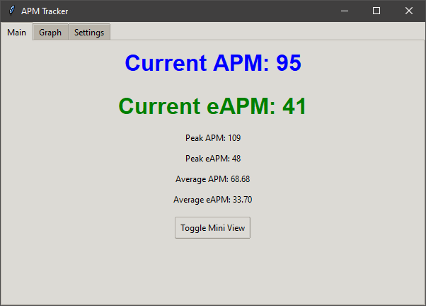
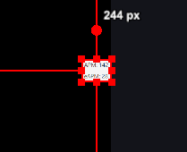

# APM Tracker

APM Tracker is a Python application that measures and displays Actions Per Minute (APM) and effective Actions Per Minute (eAPM) for computer users. It's particularly useful for gamers, especially in real-time strategy (RTS) games, where APM is a common metric of player performance.

## Features

- Real-time tracking of APM and eAPM
- Graphical display of APM and eAPM over time
- Peak APM and eAPM tracking
- Average APM and eAPM calculation
- Mini-view mode for unobtrusive monitoring
- Target program focus to track APM only for specific applications
- Adjustable transparency
- Hotkeys for quick access to features

## Project Structure

The project is organized into several modules for better maintainability:
```ascii
apmpy/
|-- src/                    # Source code directory
|   |-- main.py              # Entry point of the application
|   |-- tracker.py           # Contains the main APMTracker class
|   |-- gui_manager.py       # Manages the graphical user interface
|   |-- input_manager.py     # Handles keyboard and mouse input
|   |-- data_manager.py      # Manages data collection and calculations
|   |-- settings_manager.py  # Handles application settings
|   `-- utils.py             # Contains utility functions
|
|-- icons/                 # Application icons
|   |-- keebfire.ico
|   |-- keebfire.jpg
|   `-- keebfire.png
|
|-- screenshots/           # Application screenshots
|   |-- apm_graph.png
|   |-- apm_main_window.png
|   `-- obs_mini_window.png
|
|-- apm.py                 # Main script (possibly for backward compatibility)
|-- APMTracker.spec        # PyInstaller specification file
|-- convert_jpg.js         # Script for image conversion
|-- LICENSE                # License file
|-- README.md              # Project documentation
|-- requirements.txt       # Python package dependencies
```
### Module Descriptions

- `main.py`: The entry point of the application. It initializes the APMTracker and handles the main execution loop.

- `tracker.py`: Contains the main `APMTracker` class, which coordinates between other modules and manages the overall application state.

- `gui_manager.py`: Manages the graphical user interface. It creates and updates the main window, graph, and mini-view.

- `input_manager.py`: Handles keyboard and mouse input using the `pynput` library. It detects user actions and sends them to the tracker.

- `data_manager.py`: Manages data collection and calculations. It stores action data, calculates APM and eAPM, and provides methods for data analysis.

- `settings_manager.py`: Handles application settings. It manages saving and loading settings, as well as the target program functionality.

- `utils.py`: Contains utility functions used across the application, such as icon path resolution and window management helpers.

## How It Works

### APM (Actions Per Minute)
APM measures the total number of actions (keyboard presses and mouse clicks) performed by the user in one minute. The application counts these actions and calculates the APM in real-time, updating every second. 

- Each keystroke or mouse click is considered an action.
- There's a 50ms cooldown between actions to prevent multiple counts for a single intended action (e.g., key held down).
- The APM is calculated based on the actions performed in the last 60 seconds.

### eAPM (effective Actions Per Minute)
eAPM is a more refined metric that attempts to measure meaningful actions, filtering out repetitive or less significant inputs. The calculation of eAPM follows these rules:

- There's a 500ms cooldown between effective actions.
- An action is only considered effective if it's different from the previous action type.
- Mouse movements (for selections) are counted as effective actions if they're not immediately preceded by another selection action.

### Graphs
The application provides a real-time graph of APM and eAPM:

- The x-axis represents the last 60 seconds, with 0 being the current moment and 60 being a minute ago.
- The y-axis shows the number of actions performed in each second.
- Blue bars represent APM, while green bars represent eAPM.
- The graph updates every second, providing a rolling view of your recent action frequency.

### Target Program Functionality
The target program feature allows you to focus APM tracking on a specific application:

1. In the Settings tab, click "Set Target Program" while the desired application is in focus.
2. The name of the active window will be set as the target program.
3. APM tracking will only occur when the target program is the active window.
4. To track all programs again, click "Clear Target Program".

Note: The effectiveness of this feature may vary depending on your operating system and the specific application you're targeting.

## Requirements

- Python 3.12.5 or higher
- Required Python packages are listed in `requirements.txt`

## Installation

1. Clone this repository or download the source code.
2. Install the required packages:

   ```sh
   pip install -r requirements.txt
   ```

3. Run the script:

   ```sh
   python apm.py
   ```

## Running the Application

### Windows
Simply double-click the `APMTracker.exe` file to run the application.

### Linux
To run the Linux binary:

1. Open a terminal in the directory containing the `APMTracker` binary.
2. Make the file executable (if it's not already):
   ```sh
   chmod +x APMTracker
   ```
3. Run the application:
   ```sh
   ./APMTracker
   ```

Note: If you encounter a "permission denied" error, you may need to run the following command:
```sh
sudo chown $USER:$USER APMTracker
```

If you're using a desktop environment, you might be able to double-click the file to run it, depending on your system settings.

## Building the Application

To create a standalone executable:

1. Ensure you have PyInstaller installed:
   ```sh
   pip install pyinstaller
   ```

2. Run PyInstaller:
   ```sh
   pyinstaller --name=APMTracker --windowed --add-data "icons:icons" --icon=icons/keebfire.ico main.py
   ```

3. The executable will be created in the `dist` directory.

## Usage

- The main window displays current APM, eAPM, peak values, and averages.
- The 'Graph' tab shows a histogram of APM and eAPM over time.
- In the 'Settings' tab, you can:
  - Adjust the transparency of the window
  - Set a target program to focus APM tracking
- Use the "Toggle Mini View" button to switch between full view and mini view.
- Press Ctrl+Shift+Q to quit the application.

## Screenshots

### Main Window


### Mini Window


### Graphs


## Contributing

Contributions to improve the APM Tracker are welcome. Please feel free to submit pull requests or open issues to suggest improvements or report bugs.

## License

This project is open source and available under the [MIT License](LICENSE).

## Disclaimer

This software is for educational and personal use only. Please be aware of and respect the terms of service of any games or applications you use this with.
